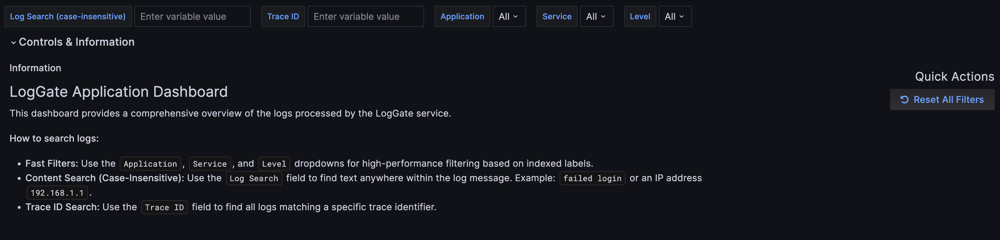
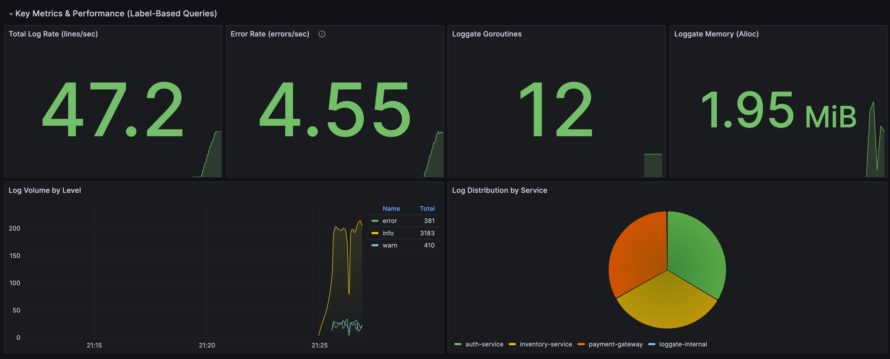
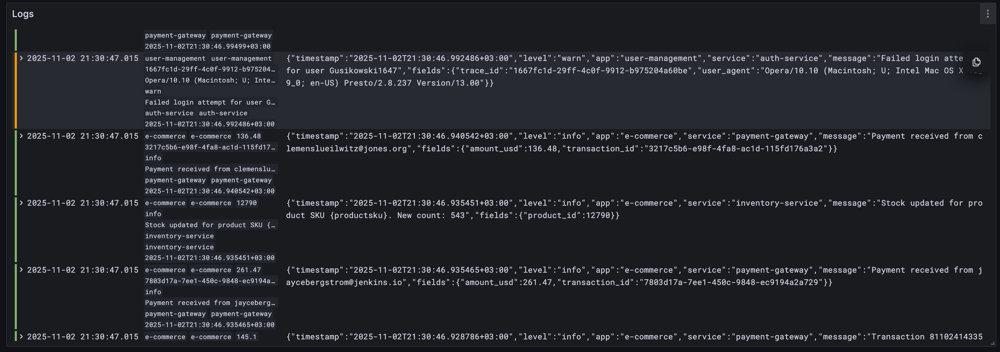

# LogGate: High-Performance Gateway for Log Routing

[RU](./README.ru.md)

[](https://go.dev/)
[](/LICENSE)

**LogGate** is a centralized gateway service for receiving, buffering, and routing logs from various applications. It is designed for high performance and easy extensibility, allowing log streams to be directed to different storage systems based on flexible rules.

The project comes with a ready-to-use monitoring stack based on **Prometheus, Grafana, and Loki**, providing a complete "out-of-the-box" solution for collecting, storing, and visualizing logs and metrics.





## Key Features

- **Centralized Ingestion:** Accepts structured JSON logs over UDP for minimal latency on the sender's side.
- **Flexible Routing:** Rules in `config.yaml` allow logs to be directed to different storages based on log attributes (`service`, `level`, etc.).
- **High Performance:** Written in Go. Uses internal buffering and batch processing to minimize load on storage systems.
- **Extensible Architecture:** Output adapters make it easy to add support for new storages (ClickHouse, Elasticsearch, etc.).
- **Ready-to-use Stack:** `docker-compose.yaml` deploys not only LogGate but also the entire necessary toolkit: Prometheus, Loki, Grafana, cAdvisor.
- **Development Tools:** Includes a log generator (`loggen`) for load testing and debugging.

## Technology Stack

- **Service:** Go
- **Orchestration:** Docker, Docker Compose
- **Metrics Collection:** Prometheus, cAdvisor
- **Log Aggregation:** Loki, Promtail
- **Visualization:** Grafana

## Quick Start

1.  **Prerequisites:** Ensure you have `Docker`, `Docker Compose`, and `make` installed.

2.  **Configuration:** Create a `.env` file from the example.

    ```bash
    cp .env.example .env
    ```

3.  **Start the Stack:** Build and run all services in the background.

    ```bash
    make up
    ```

4.  **Generate Test Logs:** Run the generator to send logs to LogGate.

    ```bash
    make gen-logs
    ```

5.  **Access Interfaces:**
    - **Grafana:** [http://localhost:3000](http://localhost:3000) (login: `admin`/`admin`)
      - _The "LogGate Application" dashboard will already be available._
    - **Prometheus:** [http://localhost:9090](http://localhost:9090)
    - **cAdvisor:** [http://localhost:8080](http://localhost:8080)

## Documentation

The full documentation is divided into several files for easy navigation.

| Section                                              | Description                                                                          |
| :--------------------------------------------------- | :----------------------------------------------------------------------------------- |
| **[1. Architecture](docs/01-architecture.md)**       | An overview of the system components, interaction diagrams, and data flow.           |
| **[2. Getting Started](docs/02-getting-started.md)** | Detailed instructions for deployment in development and production environments.     |
| **[3. Configuration](docs/03-configuration.md)**     | A detailed description of all configuration files (`config.yaml`, `.env`, Promtail). |
| **[4. Administration](docs/04-administration.md)**   | Operational tasks: monitoring, backup, troubleshooting.                              |
| **[5. Development](docs/05-development.md)**         | A guide for contributors: project structure, adding new storages.                    |

## License

This project is licensed under the MIT License. See the [LICENSE](/LICENSE) file for details.
