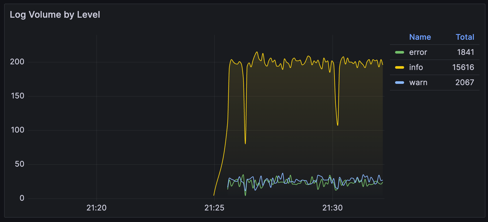

# 4. Administration and Operations

[RU](./04-administration.ru.md)

## 4.1. Basic Management Commands

All primary operations can be conveniently performed using the `Makefile`.

- **Start/Stop the Stack:**
  ```bash
  make up       # Build and start all services in the background
  make down     # Stop and remove all containers
  make restart  # Restart all services
  ```
- **Working with Logs and Status:**
  ```bash
  make status   # Show the status of all containers
  make logs     # Show and follow the logs of the loggate-service
  ```
- **Data Management:**
  ```bash
  make clean    # CAUTION: Stops services and DELETES ALL DATA (volumes)
  ```
- **Debugging:**
  ```bash
  make shell    # Open a shell inside the loggate-service container
  ```

## 4.2. Backup and Restore

The `scripts/backup.sh` and `scripts/restore.sh` scripts allow for "cold" backups of Loki data.

### Creating a Backup

This command creates a `*.tar.gz` archive with Loki data in the `backups/` directory.

```bash
make backup
```

**Process:**

1.  Checks for the `jq` utility.
2.  Finds the name of the Docker volume used by Loki.
3.  Stops `loki` and `promtail` to ensure data integrity.
4.  Runs a temporary container that archives the volume's content.
5.  Starts `loki` and `promtail` again.

### Restoring from a Backup

**WARNING:** This is a destructive operation and will completely overwrite the current Loki data.

```bash
# Restore from the latest backup in the backups/ folder
make restore

# Restore from a specific file
make restore BACKUP_FILE=backups/loki-backup-YYYY-MM-DD_HH-MM-SS.tar.gz
```

**Process:**

1.  Asks for user confirmation.
2.  Stops `loki` and `promtail`.
3.  **Completely wipes** the current Loki data volume.
4.  Unpacks the specified archive into the volume.
5.  Starts the services.

## 4.3. Monitoring

The primary monitoring tool is the `LogGate Application` dashboard in Grafana (`http://localhost:3000`).

### Dashboard Panels


- **Key Metrics:**
  - `Total Log Rate`: The total number of log lines per second. Shows the overall system load.
  - `Error Rate`: The number of logs with `error`, `crit`, or `fatal` levels. A key indicator of application health.
  - `Loggate Goroutines`: The number of goroutines in `loggate-service`. A sharp increase could indicate leaks or deadlocks.
  - `Loggate Memory (Alloc)`: The amount of memory allocated by `loggate-service`.

- **Visualizations:**
  - `Log Volume by Level`: A time-series graph showing the distribution of logs by level. Helps to identify anomalies (e.g., a sudden spike in errors).

    

  - `Log Distribution by Service`: A pie chart showing which services generate the most logs over the selected time period.

- **Logs Panel:**
  - An interactive panel for viewing and searching logs in real-time.
  - Use the variables at the top of the dashboard (`Application`, `Service`, `Level`) to quickly filter by indexed labels.
  - Use the `Log Search` field for full-text search within log content (slower than filters).

    

### Manual Checks and Queries

Use the **Explore** tab in Grafana to run custom LogQL queries against Loki.

**Example Queries:**

```logql
# Find all logs from auth-service with level ERROR
{service="auth-service", level="error"}

# Find all logs containing "failed to connect" (slow text search)
{app="user-management"} |= "failed to connect"

# Count the number of logs per minute, grouped by service
sum by (service) (rate({app="e-commerce"}[1m]))
```

## 4.4. Troubleshooting

- **LogGate is not receiving logs:**
  1.  Check the service's own logs: `make logs`.
  2.  Ensure that port `10514/udp` is not occupied by another process on the host.
  3.  Send a test packet manually using `netcat` and check the logs:
      ```bash
      echo '{"app": "test", "service": "manual", "level": "INFO", "message": "hello from netcat"}' | nc -u -w0 127.0.0.1 10514
      ```
- **Logs are not appearing in Grafana:**
  1.  Check the `promtail` logs: `docker-compose logs -f promtail`. Look for JSON parsing errors or connection issues with Loki.
  2.  Check the `loki` logs: `docker-compose logs -f loki`.
  3.  In Grafana (Data Sources section), verify that the Prometheus and Loki data sources are configured correctly and are working.
